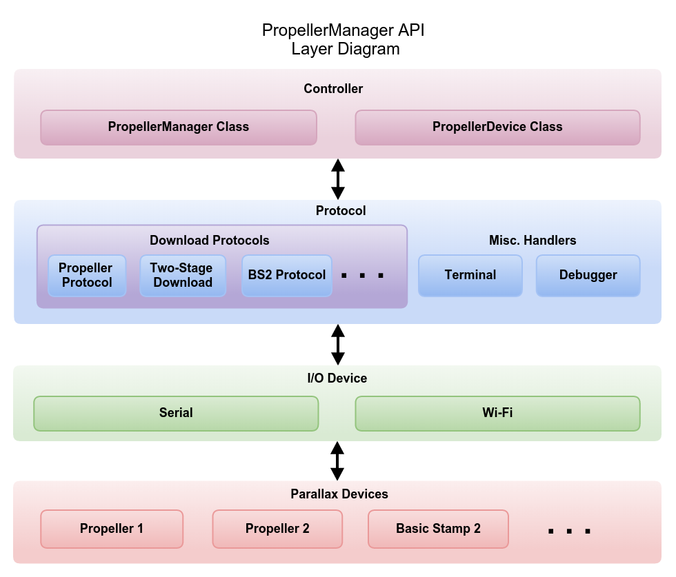
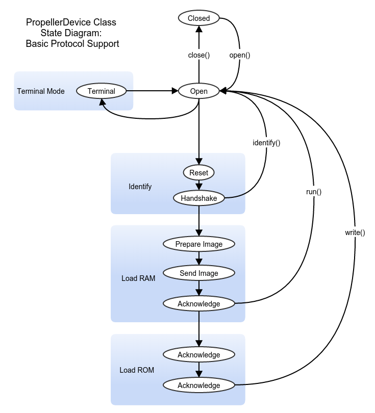

# Propeller Manager - *do more with the Propeller*

Propeller Manager is more than a download tool; it is a complete API and toolset for managing Propeller devices, no matter where they are.

## Design Goals 


### Single point of integration

The primary focus of the Propeller Manager project is to provide a single point of integration for the Propeller.

It will provide an abstraction layer that allows applications that consume this API to treat any hardware configuration as simply a list of devices, providing all of the hooks needed to interact with them in a productive way. Propeller Manager forms the basis for all of PropellerIDE's interaction with hardware, allowing a clear separation of concerns and simplifying it's code base considerably.

Propeller Manager provides a simple API to build the Propeller into applications in a cross-platform and reliable way.



### Safe device access

Propeller Manager will implement a state machine that prevents conflicts between long-running device operations and arbitrates simultaneous accesses from different parts of an application.



### Event-driven, object-oriented

Propeller Manager will be easier than ever before to integrate into applications.

### Multi-protocol

Propeller Manager will provide a framework for supporting multiple download protocols and I/O devices side-by-side, so Propeller Manager will give you a bird's eye view of your hardware at a glance, no matter what your configuration.

### Persistent sessions

Propeller Manager opens your device when you say so and looks after it until you're finished.

That means no more spurious resets, toggling the terminal controls, switching back and forth between windows, or multiple serial connections required. Finally, cross-platform debugging is easy with the Propeller.

## Usage

#### `propman` command-line interface

Propeller Manager includes a small utility to use it from the command-line.

For the most basic use cases, simply pass a binary name to `propman` to download to RAM. `propman` will use the first or only device available in the system.

```
propman Brettris.binary
```

Include the `-w` option to write the program to EEPROM.

For more complex use cases, get a list of available devices with `-l`.

```
$ propman -l
/dev/ttyUSB0
/dev/ttyS0
```

Use the `-d` option to download to a specific device.

```
propman Brettris.binary -d /dev/ttyUSB0
```

Get your `propman` version with `-v`.

```
propman -v
Propeller Manager CLI 0.0.0
```

Get more help with `-h`.

```
Usage: propman [options] FILE

A command-line wrapper to the Propeller Manager API
Copyright 2015 by Parallax Inc.

Options:
  -h, --help          Displays this help.
  -v, --version       Displays version information.
  -l, --list          List available devices
  -w, --write         Write program to EEPROM
  -d, --device <DEV>  Device to program (default: first system device)
  -p, --pin <PIN>     Pin for GPIO reset

Arguments:
  file                Binary file to download
```

## License

Propeller Manager is licensed under the GNU Public License v3.

## Author

Propeller Manager is developed by LameStation LLC in collaboration with Parallax Inc.
