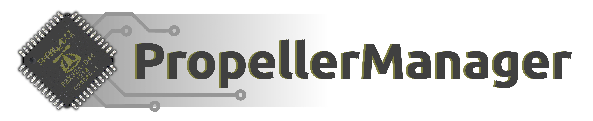

 

PropellerManager is an event-driven Qt/C++ API for developing integrated Propeller applications.

- Create rich integrated systems based on the Propeller
- Manage large numbers of Propeller devices from one computer
- Build portable software that always supports the latest hardware

PropellerManager forms the basis for [PropellerIDE](https://github.com/parallaxinc/PropellerIDE) and [BadgeHacker](https://github.com/parallaxinc/BadgeHacker).

Learn more about PropellerManager at [developer.parallax.com](http://developer.parallax.com/projects/propellermanager/doc/html/).

### Command-Line Usage

PropellerManager includes a small program called `propman` to use the library from the command-line.

Pass a binary name to `propman` to download to RAM, or use `-w` to write to EEPROM. `propman` will use the first or only device available in the system.

    propman Brettris.binary
    propman Brettris.binary -w

For more complex use cases, get a list of available devices with `-l`. Then use the `-d` option to download to a specific device.

    $ propman -l
    /dev/ttyUSB0
    /dev/ttyS0

    $ propman Brettris.binary -d /dev/ttyUSB0

Get help with `-h` or the PropellerManager version with `-v`.

### Bugs

Please report all bugs to the [PropellerManager issue tracker](https://lamestation.atlassian.net/projects/PROPMAN/issues).

### License

Copyright © 2015 Parallax Inc. PropellerManager is licensed under the GNU Public License v3.

### Credits

Propeller Manager is developed by LameStation LLC for Parallax Inc.

